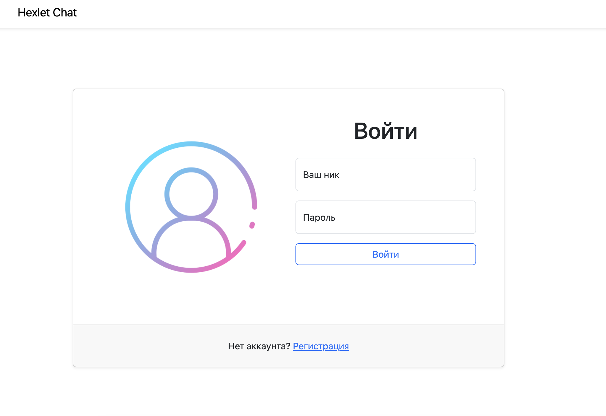
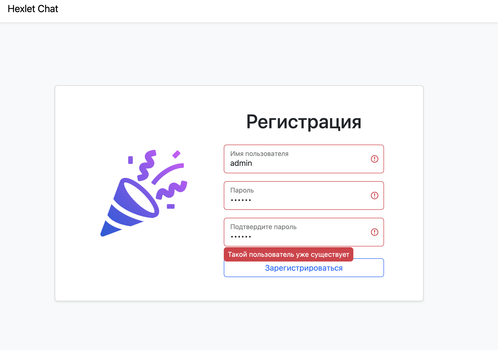
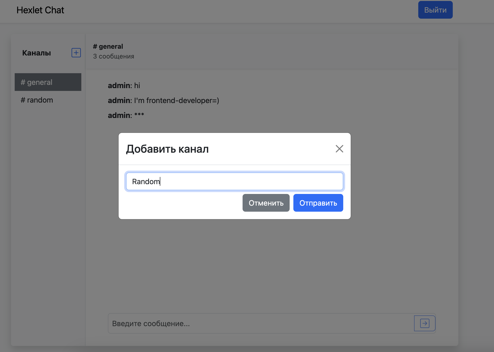
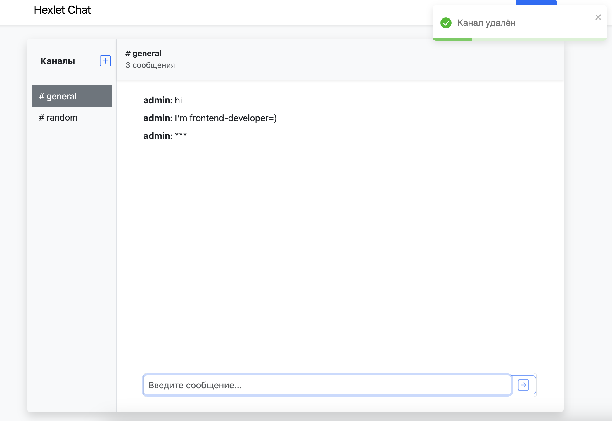

### Hexlet tests and linter status:
[](https://github.com/loki1520/frontend-project-12/actions)

##### Hexlet tests and linter status

# React chat app

A simplified version of Slack chat. You you can try the [application here](https://frontend-project-12-dsuz.onrender.com)

---

## Application examples

*Login*



*Registration*



*New channel*



*Chat*




---


## Installation & Usage

To run locally on your machine (make sure that you have node.js and npm installed)

### Requirements

node.js 18.0+

### Install

###### Clone the repository:

```
git clone https://github.com/loki1520/frontend-project-12
```

###### Install the dependencies:

```
make install
```

###### Run the app on localhost:

```
make start
```

---

### App features

* Ability to register a new user / to login an existing user
* Two default chat channels
* Ability to create new channels
* Created channels can be deleted or renamed


### Tech stack

* React/React Hooks + Redux Toolkit
* React Router v6
* React Bootstrap
* React-i18next
* Formik
* Yup
* React Toastify
* Leo-profanity
* Socket Io
* ESLint
* Rollbar
* Render
